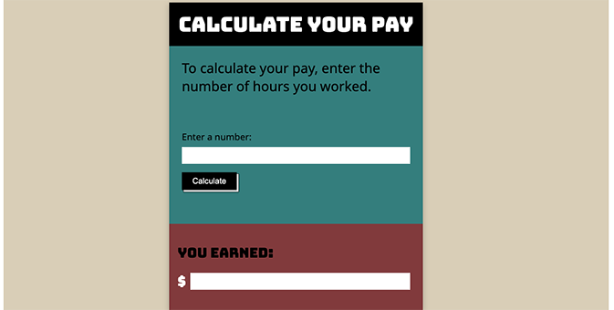

# Pay Calculator
This little web app takes user input, processes it, and dynamically returns a response to the user interface. Built with vanilla JavaScript, HTML5, CSS3, and Flexbox.

## About
The Pay Calculator is a simple, interactive web application that takes, verifies, and processes user input and returns a customized response. 

The user enters the number of hours they worked and — using fixed and entirely fictitious hourly and overtime rates — the app calculates and displays the user's pay. 

If input is missing or invalid, the app displays error messages on the user interface with instructions for the user. 

## Project Background
I designed and built the Pay Calculator to practice:

- How to capture, validate, process, and return user input client-side. 
- The single responsibility principle to make the script’s logic modular and easier to manage.    

The app is interactive and centers around a simplified web-based form that takes input from the user. The app utilizes the semantic form, label, and input html elements. 

JavaScript validates input client-side and dynamically updates the user interface via the DOM in response to the user’s input. 

Main features of the Pay Calculator project:

- The form element contains the part of the app that collects user input. The element is used mainly for semantic html reasons. It is specified without the action and method attributes, for example, and submits user input to the current page URL.

- The input and button html elements capture the user’s input which is validated client-side. The type attributes on these elements are set to allow for custom JavaScript handling of input validation and styling.

- The reset() method is used on the form to clear the input field.

- The script takes a modular approach and consists of reusable functions, each responsible for a single task.

- The event handling accommodates both mouse clicks and touch interaction pertaining to the input field and the button. This helps ensure the app responds to user actions and applies the button click animation on both desktop and mobile devices. 

- A regular expression and the test() method are used to verify the user’s input, ensuring that only numbers (decimals included, but no negative numbers) are accepted. 

- An if/else statement controls the updating of the user interface based on the user’s input: 
 
If the input is missing or invalid, the script displays an explanatory error message. The wording of the message will depend on the type of error. 

As part of the error handling, the script applies styling to the input field to draw the user’s attention to it.  

If the input is valid, the scripts takes the entered input and performs a simple calculation of the pay and displays the result on the user interface using template literals.

- The app automatically scrolls the result field of the user interface into view (if needed) when the pay result is displayed. 

## Built With 
- JavaScript
- HTML5 
- CSS3 
- Flexbox

## Launch
[See the live version of the Pay Calculator here.]()